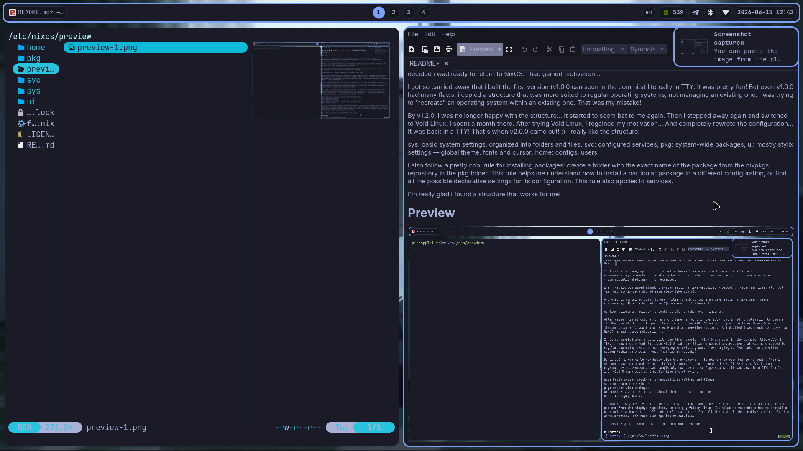
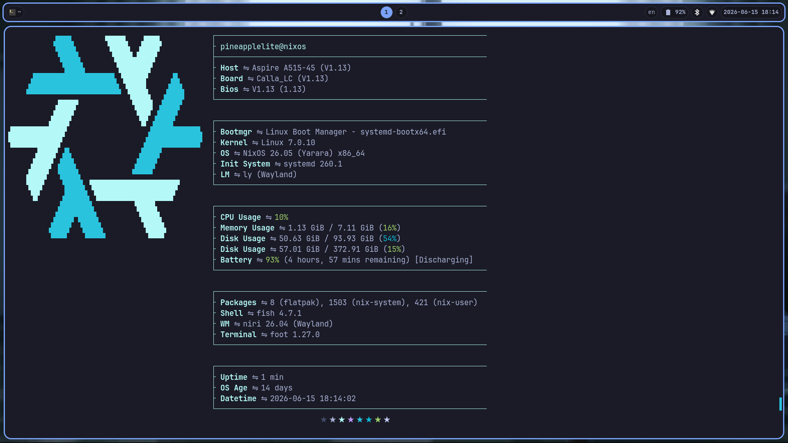

<p align="center">
    <i>A minimalist Unix-like NixOS configuration.</i>
</p>

<p align="center">
    <a href="https://github.com/pineapplelite/nixos-configuration/tags">
        
    </a>
    <a href="https://github.com/pineapplelite/nixos-configuration/blob/main/LICENSE">
        
    </a>
    <a href="https://github.com/pineapplelite/nixos-configuration/stargazers">
        
    </a>
</p>

---

# Configuration history

It started when i wanted to try something new...

I used Arch Linux with Hyprland for a long time, but in one moment it started to seem like something boring for me.

Then i tried NixOS... And it's just so good! You are literally customizing something you use every day!

But... After switching to NixOS, my interest for rEFInd is lost due "generations". At first i thought that i would soon return to my theme and make it more beautiful, cooler and modern... But i realized that this is the end. Pneaple-Boot-Theme archived June 14, 2026 at 20:30 UTC+3.

Ok, the theme is the theme, but what about the configuration? Initially, when i just started to create the structure, it looked like this:

```
.
├── app
│   ├── app.nix
│   ├── app.noctalia-shell.nix
│   └── app.zen-browser.nix
├── sys
│   ├── sys.fish.nix
│   ├── sys.nix
│   └── sys.stylix.nix
├── usr
│   ├── usr.nix
│   └── usr.user.nix
├── configuration.nix
├── flake.lock
├── flake.nix
├── hardware-configuration.nix
└── wallpaper.jpg

4 directories, 13 files
```
Yes, this configuration looks really bad... 

In this, fisrt structure, app.nix contained packages like niri, which were installed via environment.systemPackages. Flake packages were installed, as you can see, in separate files ("app.noctalia-shell.nix", for example).

When sys.nix contained standard system settings like graphics, bluetooth, system services, etc (but fish and stylix were stored separately like app's).

And usr.nix contained paths to user files (which contains an user settings like users.users.{username}). This paths had "usr.${username}.nix" standard.

configuration.nix, however, brought it all together using imports.

After using this structure for a short time, i found it very bad, but i had no motivation to change it. Because of this, i temporarily swiched to FreeBSD. After setting up a wifibox there (due to missing driver), i spent over a week on this operating system... And i was ready to return to NixOS: i had gained motivation...

I got so carried away that i built the first version (v1.0.0 can seen in the commits) litereally in TTY. It was fun! But even v1.0.0 had many flaws: i copied a structure that was more suited to regular operating systems, not managing an existing one. I was trying to "recreate" an operating system within an existing one. That was my mistake!

By v1.2.0, i was no longer happy with the structure... It started to seem bad to me again. Then i switched again... To Void Linux. I spent a month there. After trying Void Linux, i regained my motivation... And completely rewrote the configuration... It was back in a TTY! That's when v2.0.0 came out! :) I really like the structure:

> sys: basic system settings, organized into folders and files;
> svc: configured services;
> pkg: system-wide packages;
> ui: mostly stylix settings — global theme, fonts and cursor;
> home: configs, users.

I also follow a cool rule for installing packages: create a folder with the exact name of the package from the nixpkgs repository in the pkg folder. This rule helps me understand how to install this package in a different configuration, or, for example, find all the possible declarative settings for configuration of this package. This rule also applies to services.

I'm really glad i found a structure that works for me!

# Preview



>Base:
>    **DM**: ly
>    **WM**: niri
>    **Lock Screen**: gtklock
>    **Lock Idle**: swayidle
>    **Topbar**: ironbar
>    **Wallpapers**: awww
>    **Terminal**: foot
>    **Shell**: fish


# Installation

## If you don't have NixOS installed yet

### 0. Install the image on a bootable USB flash drive

Download the Minimal ISO Image from the official website:
https://nixos.org/download/

And install it on a bootable USB flash drive using your preferred method.

### 1. Network and Access

After booting, go to the console and sign in as the root:
```
sudo -i
```

Now let's connect to the internet...

First, get a list of available networks and find the required SSID:
```
nmcli device wifi list
```

Now, after verifying that your network is found, enter:
```
nmcli device wifi connect "ssid" password "password"
```
* Replace "ssid" and "password" with actual information about your wifi network.

Now let's check:
```
ping -c 3 duckduckgo.com
```
If the requests are sents, then everything is great!

### 2. File System

To find the name of the disk we need, enter:
```
lsblk
```
Find the desired disk by the size column, then move yout eyes in the same row to the name column.

In my case, the disk name is nvme0n1.

Now, having found the disk name, let's wipe it (Warning: this will delete the partitions and the data on them):
```
wipefs -a /dev/nvme0n1
```

The disk is clean. Let's start partitioning! Enter:
```
cfdisk /dev/nvme0n1
```
And select "GPT".

Let's say we have 512G. Let's use this partition set:
EFI System -> 1G;
Linux Root (x86-64 in my case) -> 96G;
Linux Home -> everything else.

Guide:
Up and down arrows navigate partitions;
Left and right arrows navigate actions;
Enter — select.

Using New, we create a partition;
Using Type, we interactively select the partition's GUID;
Using Write, we apply the changes to the disk.

So, we do all the dirty work... Now let's format it all!

First, it's worth finding out which partition is where:
```
lsblk -o NAME,SIZE
```
Set attention to the partition and its size.

For example, let's assume that:
nvme0n1p1 — BOOT
nvme0n1p2 — ROOT
nvme0n1p3 — HOME

In this case, format BOOT:
```
mkfs.fat -F 32 -n BOOT /dev/nvme0n1p1
```

Then format ROOT (using ext4 as the base):
```
mkfs.ext4 -L ROOT /dev/nvme0n1p2
```

And finally, format HOME:
```
mkfs.ext4 -L HOME /dev/nvme0n1p3
```

Done. Now we need to mount the root partition and all other partitions onto it.

Mount the root:
```
mount /dev/disk/by-label/ROOT /mnt
```

Create mount points for BOOT and HOME directly in the root:
```
mkdir -p /mnt/boot /mnt/home
```

Mount BOOT:
```
mount /dev/disk/by-label/BOOT /mnt/boot
```

Mount HOME:
```
mount /dev/disk/by-label/HOME /mnt/home
```

We're done mounting! Next step!

### 3. Preparation

First, let's generate a standard configuration for convenience and the /etc/nixos path itself:
```
nixos-generate-config --root /mnt
```


### 4. Cloning the repository

Сlone this repository:
```
git clone https://github.com/pineapplelite/nixos-configuration.git
```

And go to the folder after cloning:
```
cd nixos-configuration
```

### 5. Creating your own hardware-configuration.nix file

Delete my hardware-configuration.nix:
```
rm -rf  ./sys/hardware/hardware-configuration.nix
```

Generate a new, your hardware-configuration.nix:
```
sudo nixos-generate-config --show-hardware-config > ./sys/hardware/hardware-configuration.nix
```

### 6. Creating your user

Open the user configuration file in your favorite editor (I'll use helix in my example, without any guides):
```
hx ./home/users.nix
```
Here you can simply replace my username with your own, or create your own settings. Is simple: user is the settings for the standard users.users.{username}, and home is for home-manager.users.{username}.

### 7. Adjusting for your hardware

I have an AMD processor with an integrated GPU — my configuration is designed for them. It's a good idea to review everything in ./sys/kernel.nix and ./sys/hardware/ — these are the main places where hardware-specific settings are "hidden".

I hope you understand.

### 8. Migrating to /mnt/etc/nixos

Now that everything is set up, we can finally migrate the configuration.

Clean the default configuration:
```
rm -rf /mnt/etc/nixos/*
```

Now that everything is cleared, migrate the current configuration (make sure you are in the root directory of nixos-configuration):
```
cp -r ./* /mnt/etc/nixos/
```

### 9. Installation

The most important thing remains... Navigate to the desired location:
```
cd /mnt/etc/nixos
```

And... Let's create a new generation with this configuration!
```
nixos-install --flake .#nixos
```

---

## If you arleady using NixOS

### 1. Cloning the repository

Go to your home directory:
```
cd
```

Now clone this repository:
```
git clone https://github.com/pineapplelite/nixos-configuration.git
```

And go to the folder after cloning:
```
cd nixos-configuration
```

### 2. Creating your own hardware-configuration.nix file

Delete my hardware-configuration.nix:
```
rm -rf  ./sys/hardware/hardware-configuration.nix
```

Generate a new, your hardware-configuration.nix:
```
sudo nixos-generate-config --show-hardware-config > ./sys/hardware/hardware-configuration.nix
```

### 3. Creating your user

Open the user configuration file in your favorite editor (I'll use helix in my example, without any guides):
```
hx ./home/users.nix
```
Here you can simply replace my username with your own, or create your own settings. Is simple: user is the settings for the standard users.users.{username}, and home is for home-manager.users.{username}.

### 4. Adjusting for your hardware

I have an AMD processor with an integrated GPU — my configuration is designed for them. It's a good idea to review everything in ./sys/kernel.nix and ./sys/hardware/ — these are the main places where hardware-specific settings are "hidden".

I hope you understand.

### 5. Migrating to /etc/nixos

Now that everything is set up, we can finally migrate the configuration.

Delete your current configuration: // WARNING: it will be delete your current nixos configuration. Save it before clearing this path.
```
rm -rf /etc/nixos/*
```

Now that everything is cleared, migrate the current configuration (make sure you are in the root directory of nixos-configuration):
```
cp -r ./* /etc/nixos/
```

### 6. Installation

The most important thing remains... Navigate to the desired location:
```
cd /etc/nixos
```

And... Let's create a new generation with this configuration!
```
sudo nixos-rebuild switch --flake .#nixos
```

---

Thanks for using!
